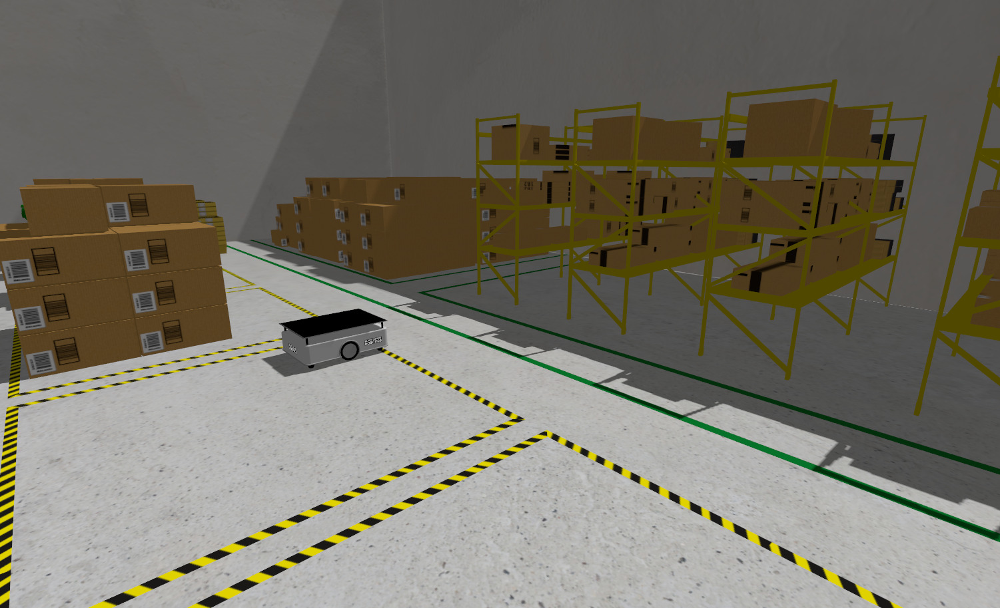
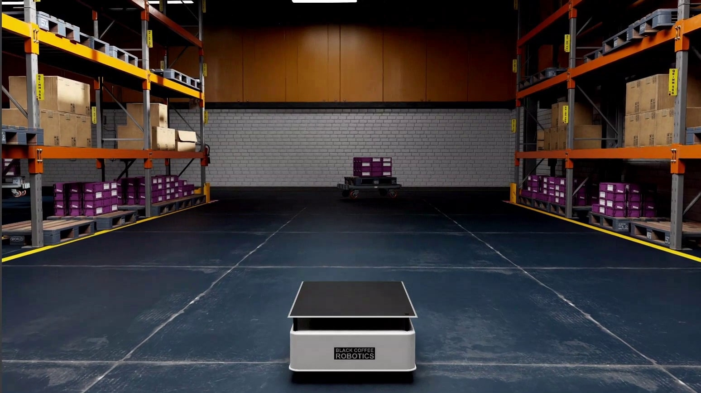
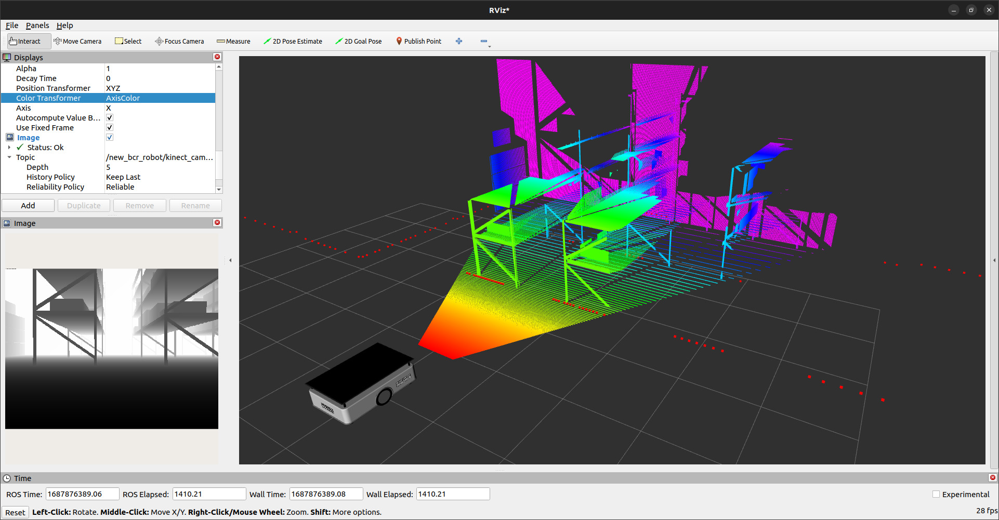

# New BCR Robot

https://github.com/blackcoffeerobotics/bcr_bot/assets/13151010/0fc570a3-c70c-415b-8222-b9573d5911c8

## About

This repository contains a Gazebo and Isaac Sim simulation for a differential drive robot, equipped with an IMU, a depth camera, stereo camera and a 2D LiDAR. The primary contriution of this project is to support multiple ROS and Gazebo distros. Currently, the project supports the following versions - 

1. [ROS Noetic + Gazebo Classic 11 (branch ros1)](#noetic--classic-ubuntu-2004)
2. [ROS2 Humble + Gazebo Classic 11 (branch ros2)](#humble--classic-ubuntu-2204)
3. [ROS2 Humble + Gazebo Fortress (branch ros2)](#humble--fortress-ubuntu-2204)
4. [ROS2 Humble + Gazebo Harmonic (branch ros2)](#humble--harmonic-ubuntu-2204)
5. [ROS2 Humble + Isaac Sim (branch ros2)](#humble--isaac-sim-ubuntu-2204)

Each of the following sections describes depedencies, build and run instructions for each of the above combinations

## Noetic + Classic (Ubuntu 20.04)

### Dependencies

In addition to ROS1 Noetic and Gazebo Classic installations, the dependencies can be installed with [rosdep](http://wiki.ros.org/rosdep)

```bash
# From the root directory of the workspace. This will install everything mentioned in package.xml
rosdep install --from-paths src --ignore-src -r -y
```

### Source Build

```bash
catkin build --packages-select bcr_bot
```

### Binary Install
To install BCR bot in the binaries:

```bash
sudo apt-get install ros-noetic-bcr-bot
```
### Run

To launch the robot in Gazebo,
```bash
roslaunch bcr_bot gazebo.launch
```
To view in rviz,
```bash
roslaunch bcr_bot rviz.launch
```
### Configuration

The launch file accepts multiple launch arguments,
```bash
roslaunch bcr_bot gazebo.launch 
	camera_enabled:=True \
	two_d_lidar_enabled:=True \
	position_x:=0.0 \
	position_y:=0.0 \
	orientation_yaw:=0.0 \
	odometry_source:=world \
	world_file:=small_warehouse.world \
	robot_namespace:="bcr_bot"
```
**Note:** To use stereo_image_proc with the stereo images excute following command: 
```bash
ROS_NAMESPACE=bcr_bot/stereo_camera rosrun stereo_image_proc stereo_image_proc
```

## Humble + Classic (Ubuntu 22.04)

### Dependencies

In addition to ROS2 Humble and Gazebo Classic installations, we need to manually install [gazebo_ros_pkgs](https://github.com/ros-simulation/gazebo_ros_pkgs/tree/ros2) (since the same branch supports Classic and Fortress)

```bash
sudo apt-get install ros-humble-gazebo-ros-pkgs
```
Remainder of the dependencies can be installed with [rosdep](http://wiki.ros.org/rosdep)

```bash
# From the root directory of the workspace. This will install everything mentioned in package.xml
rosdep install --from-paths src --ignore-src -r -y
```

### Source Build

```bash
colcon build --packages-select bcr_bot
```

### Binary Install
To install BCR bot in the binaries:

```bash
sudo apt-get install ros-humble-bcr-bot
```

### Run

To launch the robot in Gazebo,
```bash
ros2 launch bcr_bot gazebo.launch.py
```
To view in rviz,
```bash
ros2 launch bcr_bot rviz.launch.py
```
### Configuration

The launch file accepts multiple launch arguments,
```bash
ros2 launch bcr_bot gazebo.launch.py \
	camera_enabled:=True \
	two_d_lidar_enabled:=True \
	stereo_camera_enabled:=False \
	position_x:=0.0 \
	position_y:=0.0 \
	orientation_yaw:=0.0 \
	odometry_source:=world \
	world_file:=small_warehouse.sdf \
	robot_namespace:="bcr_bot"
```
**Note:** To use stereo_image_proc with the stereo images excute following command: 
```bash
ros2 launch stereo_image_proc stereo_image_proc.launch.py left_namespace:=bcr_bot/stereo_camera/left right_namespace:=bcr_bot/stereo_camera/right
```
## Humble + Fortress (Ubuntu 22.04)

### Dependencies

In addition to ROS2 Humble and [Gazebo Fortress installations](https://gazebosim.org/docs/fortress/install_ubuntu), we need to manually install interfaces between ROS2 and Gazebo sim as follows,

```bash
sudo apt-get install ros-humble-ros-gz-sim ros-humble-ros-gz-bridge ros-humble-ros-gz-interfaces 
```
Remainder of the dependencies can be installed with [rosdep](http://wiki.ros.org/rosdep)

```bash
# From the root directory of the workspace. This will install everything mentioned in package.xml
rosdep install --from-paths src --ignore-src -r -y
```

### Source Build

```bash
colcon build --packages-select bcr_bot
```

### Binary Install
To install BCR bot in the binaries:

```bash
sudo apt-get install ros-humble-bcr-bot
```

### Run

To launch the robot in Gazebo,
```bash
ros2 launch bcr_bot ign.launch.py
```
To view in rviz,
```bash
ros2 launch bcr_bot rviz.launch.py
```

### Configuration

The launch file accepts multiple launch arguments,
```bash
ros2 launch bcr_bot ign.launch.py \
	camera_enabled:=True \
	stereo_camera_enabled:=False \
	two_d_lidar_enabled:=True \
	position_x:=0.0 \
	position_y:=0.0  \
	orientation_yaw:=0.0 \
	odometry_source:=world \
	world_file:=small_warehouse.sdf
```
**Note:** To use stereo_image_proc with the stereo images excute following command: 
```bash
ros2 launch stereo_image_proc stereo_image_proc.launch.py left_namespace:=bcr_bot/stereo_camera/left right_namespace:=bcr_bot/stereo_camera/right
```

## Humble + Harmonic (Ubuntu 22.04)

### Dependencies

In addition to ROS2 Humble and [Gazebo Harmonic installations](https://gazebosim.org/docs/harmonic/install_ubuntu), we need to manually install interfaces between ROS2 and Gazebo sim as follows,

```bash
sudo apt-get install ros-humble-ros-gzharmonic
```
Remainder of the dependencies can be installed with [rosdep](http://wiki.ros.org/rosdep)

```bash
# From the root directory of the workspace. This will install everything mentioned in package.xml
rosdep install --from-paths src --ignore-src -r -y
```

### Build

```bash
colcon build --packages-select bcr_bot
```

### Run

To launch the robot in Gazebo,
```bash
ros2 launch bcr_bot gz.launch.py
```
To view in rviz,
```bash
ros2 launch bcr_bot rviz.launch.py
```

### Configuration

The launch file accepts multiple launch arguments,
```bash
ros2 launch bcr_bot gz.launch.py \
	camera_enabled:=True \
	stereo_camera_enabled:=False \
	two_d_lidar_enabled:=True \
	position_x:=0.0 \
	position_y:=0.0  \
	orientation_yaw:=0.0 \
	odometry_source:=world \
	world_file:=small_warehouse.sdf
```
**Note:** 
1. To use stereo_image_proc with the stereo images excute following command: 
```bash
ros2 launch stereo_image_proc stereo_image_proc.launch.py left_namespace:=bcr_bot/stereo_camera/left right_namespace:=bcr_bot/stereo_camera/right
```
2. Harmonic support is not available in the bcr_bot binaries yet.

**Warning:**  `gz-harmonic` cannot be installed alongside gazebo-classic (eg. gazebo11) since both use the `gz` command line tool.

### Humble + Isaac Sim (Ubuntu 22.04)

### Dependencies

In addition to ROS2 Humble [Isaac Sim installation](https://docs.omniverse.nvidia.com/isaacsim/latest/installation/index.html) with ROS2 extension is required. Remainder of bcr_bot specific dependencies can be installed with [rosdep](http://wiki.ros.org/rosdep)

```bash
# From the root directory of the workspace. This will install everything mentioned in package.xml
rosdep install --from-paths src --ignore-src -r -y
```

### Build

```bash
colcon build --packages-select bcr_bot
```

### Run

To launch the robot in Isaac Sim:
- Open Isaac Sim and load the `warehouse_scene.usd` or `scene.usd` from [here](usd). 
- Add in extra viewports for different camera views.
- Start the Simulation: Run the simulation directly within Isaac Sim.
- The following USDs are included in the package:
	- `warehouse_scene.usd` - Warehouse scene with a robot.
	- `scene.usd` - Scene with a robot in a empty world.
	- `bcr_bot.usd` - Robot model that can be imported into any scene.
	- `ActionGraphFull.usd` - Action graph for the robot to publish all the required topics.

To view in rviz:
```bash
ros2 launch bcr_bot rviz.launch.py
```
NOTE: The command to run mapping and navigation is common between all versions of gazebo and Isaac sim see [here](#mapping-with-slam-toolbox).

### Mapping with SLAM Toolbox

SLAM Toolbox is an open-source package designed to map the environment using laser scans and odometry, generating a map for autonomous navigation.

NOTE: The command to run mapping is common between all versions of gazebo.

To start mapping:
```bash
ros2 launch bcr_bot mapping.launch.py
```

Use the teleop twist keyboard to control the robot and map the area:
```bash
ros2 run teleop_twist_keyboard teleop_twist_keyboard cmd_vel:=/bcr_bot/cmd_vel
```

To save the map:
```bash
cd src/bcr_bot/config
ros2 run nav2_map_server map_saver_cli -f bcr_map
```

### Using Nav2 with bcr_bot

Nav2 is an open-source navigation package that enables a robot to navigate through an environment easily. It takes laser scan and odometry data, along with the map of the environment, as inputs.

NOTE: The command to run navigation is common between all versions of gazebo and Isaac sim.

To run Nav2 on bcr_bot:
```bash
ros2 launch bcr_bot nav2.launch.py
```

### Simulation and Visualization
1. Gz Sim (Ignition Gazebo) (small_warehouse World):
	

2. Isaac Sim:
	 

3. Rviz (Depth camera) (small_warehouse World):
	
